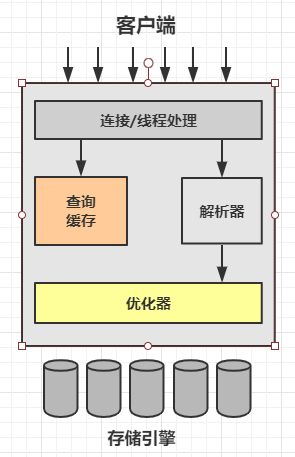

### 1.1 MySQL逻辑架构



```
最上层的服务并不是MySQL所独有的，大多数基于网络的客户端/服务器的工具或者服务都有类似的架构。 
比如连接处理、授权认证、安全等等。

第二层架构是MySQL比较有意思的一部分。 
大多数MySQL的核心服务功能都在这一层，包括解析、分析、优化、缓存以及所有的
内置函数(例如，日期、时间、数学和加密函数),
所有跨存储引擎的功能都在在这一层实现: 存储过程、触发器、视图等。
   
第三层包含了存储引擎。
存储引擎负责MySQL中数据的存储和提取。
和GNU/Linux下的各种文件系统一样，每个存储引擎都有它的优势和劣势。
服务器通过API与存储引擎进行通信。
这些接口屏蔽了不同存储引擎之间的差异，使得这些差异对上层的查询过程透明。
存储引擎API包含了几十个底层函数，用于执行诸如"开启一个事务"或者"根据主键提取一行记录"等操作中。
但存储引擎不会去解析SQL(注1) 
不同的存储引擎之间也不会相互通信,而只是简单的响应上层服务器的请求。
```

> 注1: InnoDB是一个例外,它会解析外键定义,因为MySQL服务器本身没有实现该功能。