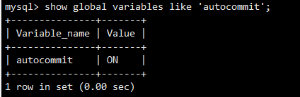

##### 1.3.3 MySQL中的事务

MySQL中提供了俩种事务型的存储引擎：InnoDB和NDB Cluster。

**自动提交 (AUTOCOMMIT)**

    MySQL默认采用自动提交(AUTOCOMMIT)模式。
    也就是说，如果不是显式地开始一个事务，则每个查询都被当作一个事务执行提交操作。
    在当前连接中，可以通过设置AUTOCOMMIT变量来启用或禁用自动提交模式：

